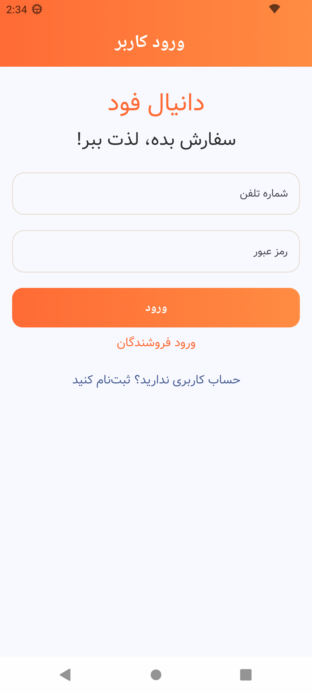
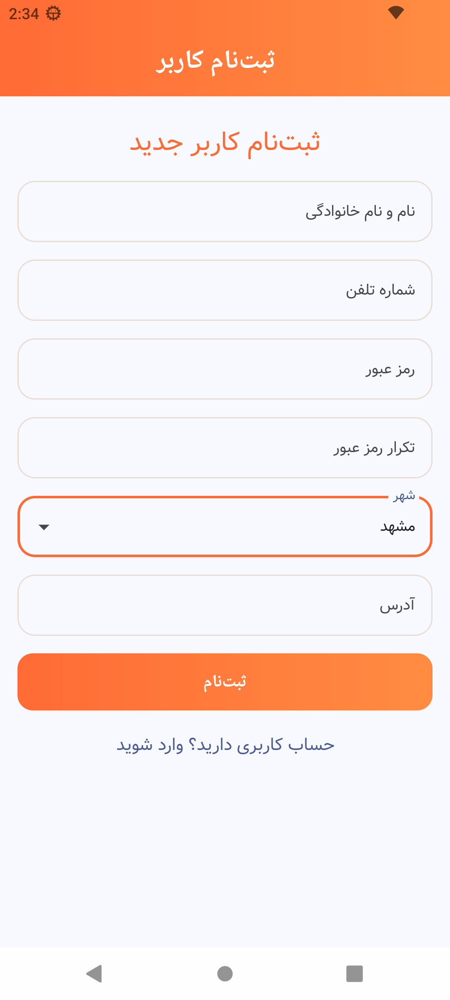
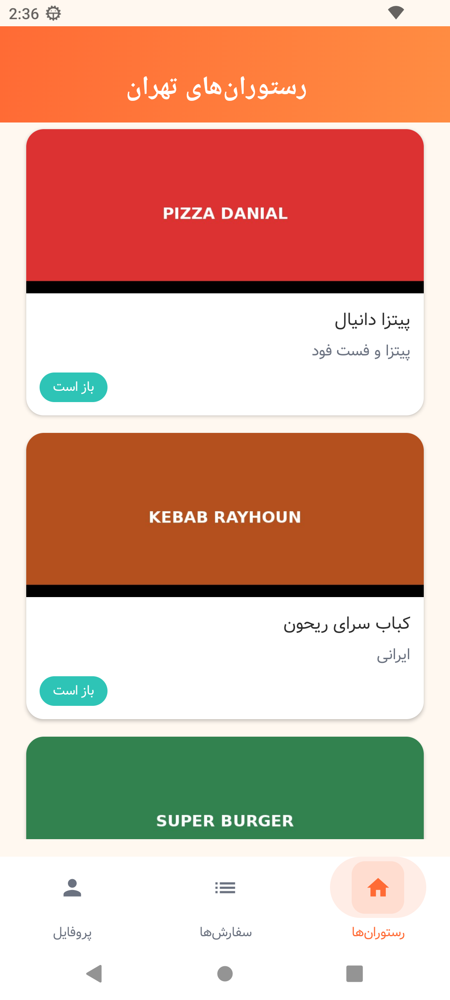
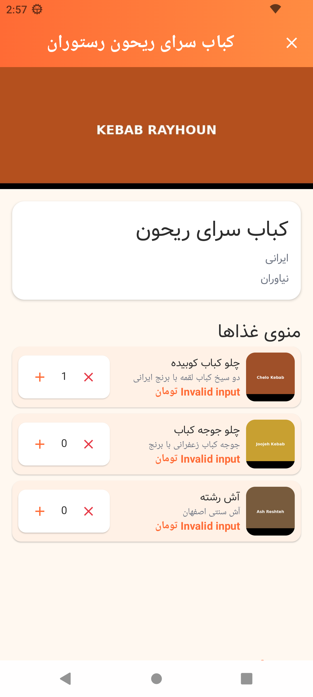
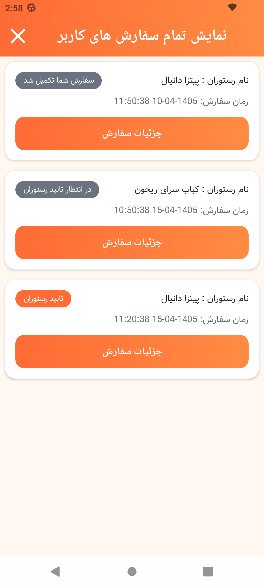
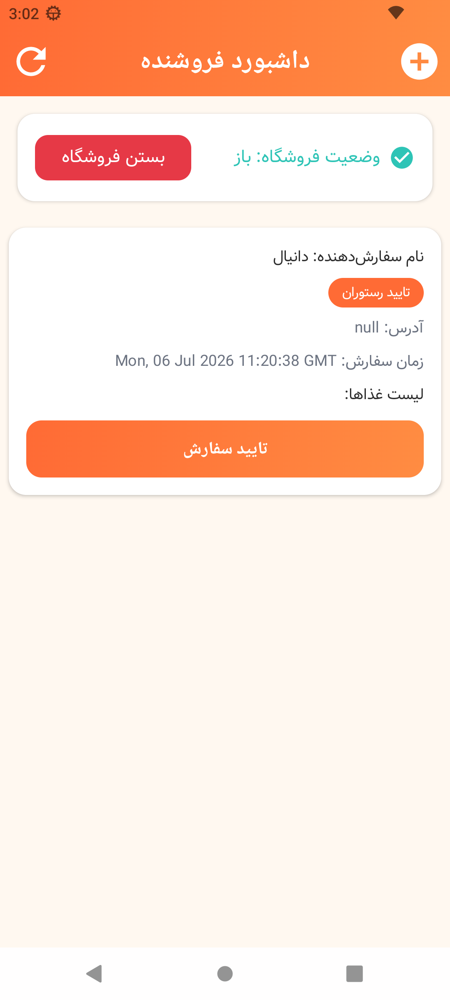
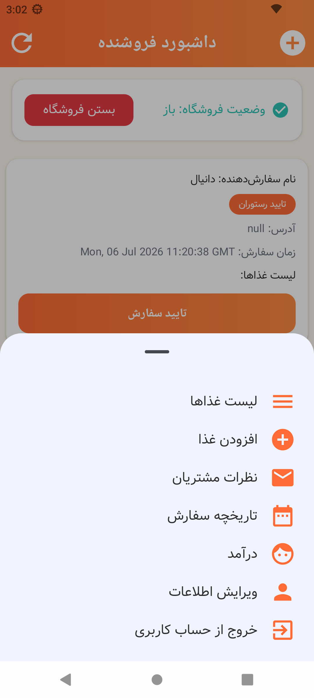

# دانیال فود 🍔📱

## معرفی
دانیال فود یک اپلیکیشن سفارش غذا برای استان خراسان رضوی است که با **Kotlin** و **Jetpack Compose** ساخته شده.
این اپلیکیشن دو نقش کاربری دارد: **مشتری** و **فروشنده (رستوران)**.

## ویژگی‌ها

### مشتری
- مرور رستوران‌ها بر اساس شهر
- مشاهده منوی غذاها با تصاویر و قیمت
- ثبت سفارش با کنترل تعداد
- پیگیری وضعیت سفارش
- نوشتن و مدیریت نظرات
- ویرایش اطلاعات کاربری

### فروشنده
- داشبورد مدیریت سفارش‌ها
- باز و بسته کردن فروشگاه
- تایید، تکمیل و لغو سفارش‌ها
- مدیریت منوی غذا (افزودن، ویرایش، حذف)
- مشاهده درآمد ماهانه و تسویه حساب
- مدیریت نظرات مشتریان
- ویرایش بنر و اطلاعات رستوران

### فنی
- رابط کاربری مدرن با پالت رنگی گرم و پرانرژی (Spice Market)
- کامپوننت‌های قابل استفاده مجدد (GradientTopBar, GradientButton, ModernCard, StatusChip)
- معماری Jetpack Compose با Material 3
- پشتیبانی از RTL (راست به چپ)
- فونت وزیر برای متن‌های فارسی

## اسکرین‌شات‌ها

### ورود و ثبت‌نام

 

### صفحه اصلی و رستوران‌ها

 

### سفارش‌ها

### پنل فروشنده

 

---

# Daniyal Food 🍔📱

## Introduction
Daniyal Food is a food delivery app for Khorasan Razavi province, built with **Kotlin** and **Jetpack Compose**.
The app supports two roles: **Customer** and **Seller (Restaurant)**.

## Features

### Customer
- Browse restaurants by city
- View food menu with images and prices
- Place orders with quantity controls
- Track order status
- Write and manage comments
- Edit profile information

### Seller
- Order management dashboard
- Open/close store status
- Accept, complete, and cancel orders
- Manage food menu (add, edit, delete)
- View monthly income and settlement
- Manage customer comments
- Edit restaurant banner and info

### Technical
- Modern UI with warm, vibrant color palette (Spice Market theme)
- Reusable components (GradientTopBar, GradientButton, ModernCard, StatusChip)
- Jetpack Compose architecture with Material 3
- RTL (Right-to-Left) support
- Vazir font for Persian text

## Screenshots

### Login & Registration

 

### Home & Restaurants

 

### Orders

### Seller Dashboard

 

## Tech Stack
- Kotlin + Jetpack Compose
- Material 3
- Volley (Networking)
- Glide + Coil (Image Loading)
- Gson (JSON Serialization)
- Navigation Compose

## Backend
The app connects to a Flask backend running at `http://192.168.1.11:5000`.

## License
This project is for educational purposes.
