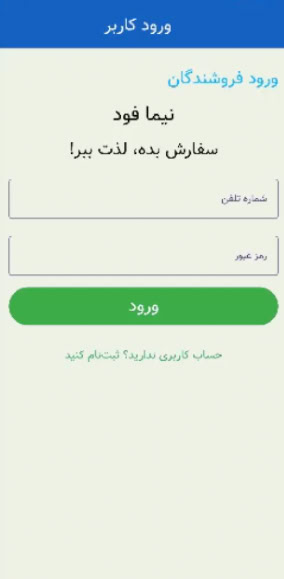
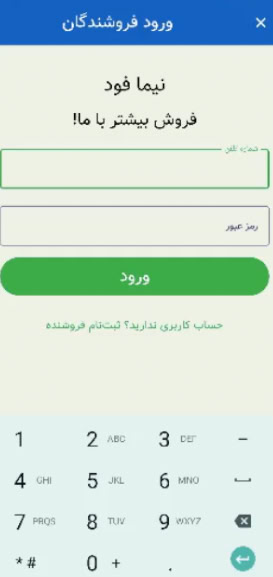
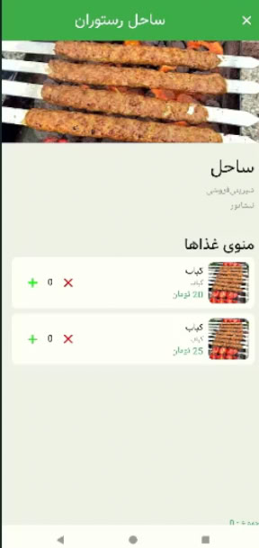
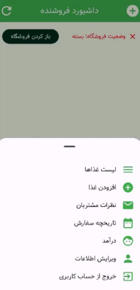

# برنامه سفارش غذا 🍔📱

## معرفی
این پروژه یک اپلیکیشن سفارش غذاست که با **Kotlin** و **Jetpack Compose** ساخته شده.  
رابط کاربری برنامه مدرن و دکلراتیو طراحی شده و معماری قدرتمندی برای مدیریت سفارش‌ها، رستوران‌ها و اطلاعات کاربران داره.  

## ویژگی‌ها
- طراحی رابط کاربری مدرن با Jetpack Compose  
- مدیریت سفارش‌ها و پیگیری وضعیت آن‌ها  
- نمایش و مدیریت رستوران‌ها  
- ذخیره و مدیریت اطلاعات کاربران  
- کد مرتب و قابل فهم برای یادگیری  

## هدف
این پروژه برای کسانیه که می‌خوان درک بهتری از ساخت اپلیکیشن‌های اندرویدی با Kotlin و Jetpack Compose پیدا کنن و نمونه‌ای عملی رو بررسی کنن.  
### Screenshot اسکرین شات

 

 

 

 

